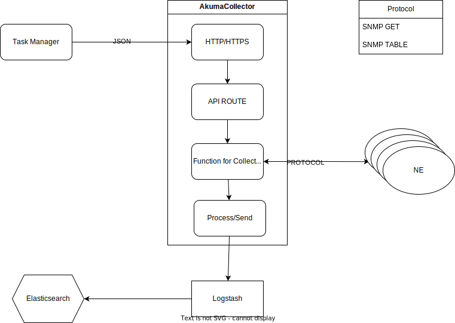

# AkumaCollector

AkumaCollector is a Node.js-based data collection tool that utilizes SNMP and other APIs to gather information from various sources. It allows real-time monitoring, transformation, and storage of diverse data types, enabling centralized insights for informed decision-making.

## Installation

1. Clone the repository: `git clone https://github.com/cesarmacias/AkumaCollector.git`
2. Install dependencies: `npm install`

## Usage

1. Set the required environment variables in a `.env` file or your preferred method.
2. Run AkumaCollector, option 1: `node akuma.js`
3. Run AkumaCollector, option 2: `npm run start`
4. Run AkumaCollector, in debug: `npm run debug`

## Configuration

Modify the `.env` file to configure the following options:

- `SEND_HOST`: The host to which the collected data will be sent.
- `SEND_PORT`: The port number on the host to which the data will be sent.
- `LISTEN_PORT`: The port number on which AkumaCollector will listen for API requests.
- `SEND_OPTION`: The option for sending the results (tcp, udp, or log for debugging).
- `PRIVATE_KEY_PATH`: The path to the private key file for HTTPS server.
- `CERTIFICATE_PATH`: The path to the certificate file for HTTPS server.
- `PROTOCOL`: The protocol for API, could be `http` or `https`

## API Routes

- `POST /snmp/get`: Performs SNMP GET operation based on the provided JSON payload. Validates and retrieves data from the specified hosts using SNMP.

- `POST /snmp/table`: Performs SNMP GET TABLE operation based on the provided JSON payload. Validates and retrieves data from the specified hosts using SNMP. This method fetches the value for all OIDs lexicographically following a specified OID in the MIB tree which have the specified OID as their base.

## JSON Payload Structure

The JSON payload sent to `/snmp/get` route should follow the below structure:

```json
{
  "hosts": ["host1", "host2"],
  "community": "public",
  "maxRepetitions": 50,
  "measurement": "measurement_name",
  "options": {
    "version": "2c",
    "retries": 2,
    "timeout": 500,
    "port": 161
  },
  "oids": [
    {
      "oid": "1.3.6.1.2.1.1.1.0",
      "name": "sysDescr",
      "type": "hex",
      "conversion": "ipv4",
      "tag": true,
      "index_slice": [0, 1],
      "split": " "
    },
    {
      "oid": "1.3.6.1.2.1.2.2.1.6",
      "name": "ifPhysAddress",
      "type": "hex",
      "conversion": "number"
    }
  ],
  "maxConnections": 500,
  "inherited": [
    {
      "oid": "1.3.6.1.2.1.1.5.0",
      "name": "sysName"
    }
  ],
  "extraInfo": {
    "key": "value"
  }
}
```

Refer to the code comments for detailed information on each field and their usage.

## OIDs Structure

The treated result is returned as an object with a structure that depends on the OID configuration. The field name is determined by the OID name, and the treated value is assigned to that field.
The treated SNMP result applies specific conversions and treatments based on the provided OID configuration. Here are some key aspects of its behavior:

- If the result is a varbind error, it returns an object with the error information.
- If the result contains multiple values (an array), it treats each value individually.
- The function applies different treatments based on the type of the SNMP value (ObjectType) and the conversions specified in the OID configuration.
- Supported conversions include:
  - `OctetString`: If the OID has the `type`  property whith value `hex`, it returns the value as a hexadecimal string. If it has a type of `regex` and a regex pattern is provided, it performs a regex match and returns an object with matched values mapped to field names.
  - `Counter64`: Treats the value as a 64-bit counter and returns the accumulated value.
  - `Opaque`: Returns the value as a string.
  - `TimeTicks`: Treats the value as a time duration and returns it divided by 100.0.
- Additional treatments include:
  - If the OID has a `split` property, this option allows you to specify a separator to split a string into an array of substrings, and if it is an array, it can also limit the result.
  - If the OID has a `conversion` property set to `number`, it converts the treated value to a number.
  - If the OID has a `conversion` property set to `ipv4` and the treated value is a number, it converts it to a standard IPv4 address format.
  - If the OID has a `conversion` property set to `ipv4` and the treated value is a string, it performs additional formatting to convert common representations (such as hexadecimal) to the standard IPv4 format.

## Tools

1. Create Certificates files: `make-cert.sh`
   - read `.cert.env` for enviaroment variables
2. Send JSON to API to test: `examples/test-api.sh`
   - read `.env` for enviaroment variables: PROTOCOL, DOMAIN, LISTEN_PORT, CLIENT_CRT, CLIENT_KEY and CERTIFICATE_PATH
   - argument 1 for API ROUTE
   - argument 2 path to JSON file to send
   - example: `bash examples/test-api.sh snmp/get examples/snmp-get.json`

## Results

The results that the collector receives will be sent by UDP or TCP in JSON format. For use with an external database will need a process to receive the data and save it in the database. For Elasticsearch with queue management, could use Logstash with the plugin [UDP input](https://www.elastic.co/guide/en/logstash/current/plugins-inputs-udp.html)

## Diagram



## Manuals

1. [How to create a docker image for AkumaCollector](docs/DOCKER.md)
2. [How to make a service for AkumaCollector](docs/service.md)

## Instalation and Update

For install as a service `akuma` in path `/usr/local/AkumaCollector` and owned by user `akuma`, you can use the script `akuma-install.sh`

```bash
sudo wget -O akuma-install.sh https://raw.githubusercontent.com/cesarmacias/AkumaCollector/main/akuma-install.sh && sudo bash akuma-install.sh && sudo rm akuma-install.sh
```

with default configuration

```bash
SEND_HOST="localhost"
SEND_PORT=2514
LISTEN_PORT=3000
SEND_OPTION="udp"
PROTOCOL="http"
```

For Update you can use the script `akuma-update.sh`

```bash
sudo wget -O akuma-update.sh https://raw.githubusercontent.com/cesarmacias/AkumaCollector/main/akuma-update.sh && sudo bash akuma-update.sh && sudo rm akuma-update.sh
```

## License

This project is licensed under the [MIT License](https://opensource.org/licenses/MIT).
